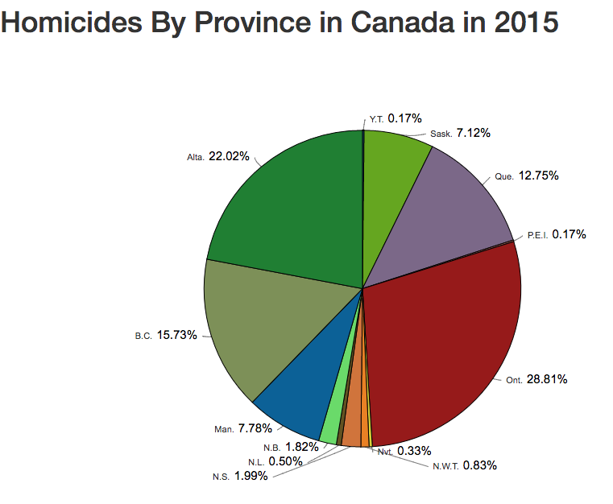

# canadian-crimerates

  This project was to show people the Canadian homicides rates in 2015 by province. There are 2 ways this is done, first is done  $ through a total number of murders that took place in each province last year. Image one bellow shows this data in the form of a pie chart.

  The second way is through breaking each provinces' homicide rate down per every 100000 people. For example in Ontario last year  we had 1.26 people die for every 100000 compared to Alberta which had 3.17 people murdered for every 100000. Finally, overall   homicides rates in Canada was 1.68 per every thousand which makes Canada one of the safer places in the world, but compared to other developed nations in Europe it is relatively high.

---

---

---

### Consulted the following resources:

  1. [D3 Tips and Tricks](https://bl.ocks.org/d3noob/bdf28027e0ce70bd132edc64f1dd7ea4)    
  2. [D3 Pie Chart library](https://github.com/benkeen/d3pie/)
  3. [List of countries by intentional homicide rate](https://en.wikipedia.org/wiki/List_of_countries_by_intentional_homicide_rate)
  4. [Crime in Canada](https://en.wikipedia.org/wiki/Crime_in_Canada)

---

### Data:

 1. [Atlantic Provinces (NFL, NB,  PEI, NS)](http://www.statcan.gc.ca/tables-tableaux/sum-som/l01/cst01/legal50a-eng.htm)
 2. [Canada, Quebec, and Ontario](http://www.statcan.gc.ca/tables-tableaux/sum-som/l01/cst01/legal50a-eng.htm)
 3. [Prairie Provinces (Man, Alb, Sas, and BC)](http://www.statcan.gc.ca/tables-tableaux/sum-som/l01/cst01/legal50c-eng.htm)
 4. [Territories(YT, NWT, NW)](http://www.statcan.gc.ca/tables-tableaux/sum-som/l01/cst01/legal50d-eng.htm)
